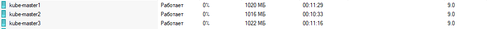
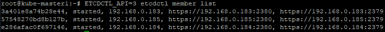
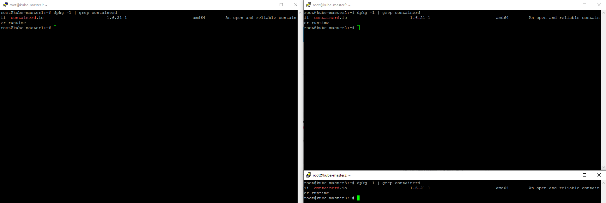
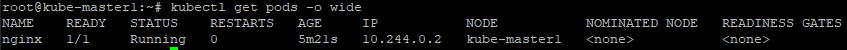

# Домашнее задание к занятию «Установка Kubernetes»

1. Машины c ubuntu для кластера развёрнуты:  
     
   На kube-master и kube-worker'ы установлен containerd:  
     
     
   Kubernetes кластер инициализирован при помощи kubeadm:  
     
     
   Kubectl get nodes после применения flannel в качестве cni:  
     
   kube-wroker'ы присоеденены к кластеру при помощи команды из вывода kubeadm init:  
     
   Запущенный в поднятом kubernetes под с nginx:  
   

2. Данное задание выполняется на виртуальных машинах личного ПК. В связи с ограниченностью ресурсов все 3 мастера будут выполнять, в том числе, и функции воркеров.  
   Машины с ubuntu развёрнуты:  
     
   Конфигурационные файлы KeepAlived:  
   [kube-master1-keepalived.conf](./files/kube-master1-keepalived.conf)  
   [kube-master2-keepalived.conf](./files/kube-master2-keepalived.conf)  
   [kube-master3-keepalived.conf](./files/kube-master3-keepalived.conf)  
   KeepAlived запущен:  
     
   Файлы сервиса ETCD:  
   [kube-master1-etcd.service](./files/kube-master1-etcd.service)  
   [kube-master2-etcd.service](./files/kube-master2-etcd.service)  
   [kube-master3-etcd.service](./files/kube-master3-etcd.service)  
   Запущенный ETCD кластер:  
     
   На все машины установле containerd:  
     
   Конфигурационный файл инициализации Kubernetes кластера:  
   [config.yaml](./files/config.yaml)  
   Первая нода инициализирована:  
     
     
   Оставшиеся две ноды также успешно присоеденены к кластеру:  
     
     
   Kubectl get nodes после применения flannel в качестве cni:  
     
   Запущенный в поднятом kubernetes под с nginx:  
   